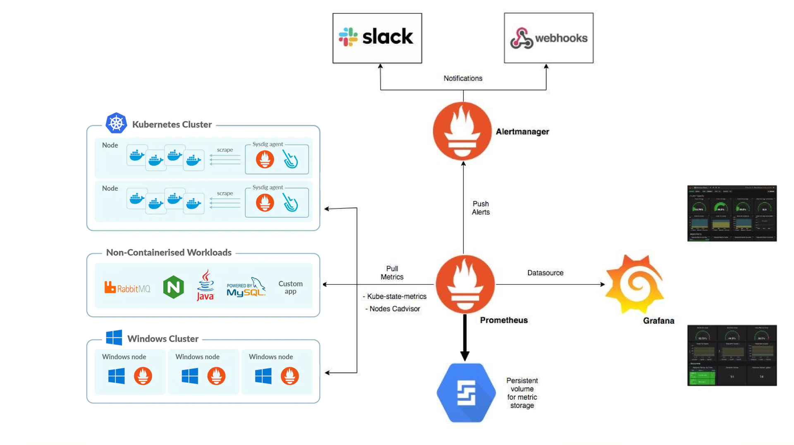

# Question 1

# Question 2: Monitoring Architecture for Resource Utilization

1. **Multi-Cluster and Multi-Environment Monitoring**:
   - Monitors different environments like Kubernetes clusters, traditional workloads, and Windows clusters.
   - Ensures the monitoring system is scalable and works with various technology stacks.

2. **Prometheus for Metrics Collection**:
   - **Prometheus** collects metrics from different sources:
     - **Kubernetes Clusters**: Uses tools like `kube-state-metrics` and `cAdvisor` to gather metrics from containers and nodes.
     - **Non-Containerized Workloads**: Uses various tools to collect metrics from services like RabbitMQ, NGINX, Java apps, MySQL databases, and custom apps like `blackbox_exporter`, i had a **bash repository** to install and uninstall that on my github.
     - **Windows Clusters**: Collects metrics from Windows nodes using Prometheus node exporters.
   - Prometheus can handle high traffic by scaling horizontally, and running multiple Prometheus servers helps manage load and prevents failure.

3. **Agents and Node Exporters**:
   - **Sysdig agents** provide deep insights into container environments on Kubernetes nodes.
   - **Node exporters** gather metrics on both Kubernetes and Windows nodes, including CPU, memory, disk, and network usage.

4. **Alertmanager for Alerting**:
   - **Alertmanager** works with Prometheus to manage alerts based on set rules.
   - Sends notifications through various channels like Slack, email, and custom webhooks to ensure timely and diverse alerting.

5. **Grafana for Visualization**:
   - **Grafana** displays metrics from Prometheus in a customizable and easy-to-use interface.
   - Helps create dashboards that provide real-time insights into system performance.

6. **Persistent Storage**:
   - Metrics data collected by Prometheus is stored in a persistent volume, ensuring data is kept safe and available even if the system restarts or fails.

## Scalability and Resilience

- **Horizontal Scaling**: The system can grow by adding more Prometheus servers and exporters to handle increased traffic.
- **High Availability**: Multiple Prometheus servers can be used to avoid single points of failure, ensuring continuous monitoring.
- **Resilient Alerting and Visualization**: With multiple alerting options and backup Grafana instances, the system stays operational during heavy load or partial failures.

## Conclusion

This monitoring setup is designed to be scalable, resilient, and responsive. It uses open-source tools like Prometheus, Alertmanager, and Grafana to provide effective monitoring and alerting across various environments, ensuring good performance and quick issue resolution.

# Question 3: Troubleshooting Service Downtime or Slowness

## 1. Acknowledge and Assess

- **Acknowledge the Alert**: Confirm the alert is valid.
- **Check Metrics**: Use monitoring tools to view key performance indicators (CPU, memory, network, etc.).

## 2. Verify the Issue

- **Test the Service**: Check if the service is actually down or slow by accessing it directly.
- **Review Logs**: Look at logs for errors or warnings that might explain the problem.

## 3. Identify the Root Cause

- **Check Resources**: See if the service is using too much CPU, memory, or network bandwidth.
- **Check Dependencies**: Make sure all connected services (like databases) are working correctly.
- **Review Changes**: Look at recent changes or deployments that might have caused the issue.

## 4. Resolve the Issue

- **Restart the Service**: Sometimes, restarting can fix temporary problems.
- **Adjust Resources**: Increase resources or fix any configuration issues if the service is overloaded.
- **Apply Fixes**: Make code or configuration changes based on what you found in the logs.

## 5. Test and Verify

- **Test the Service**: Ensure the service is working properly after making changes.
- **Monitor**: Keep an eye on the service to confirm the problem is resolved.

## 6. Document and Prevent

- **Document**: Write down what happened, how you fixed it, and any lessons learned.
- **Update Runbooks**: Add the new information to your troubleshooting guides.
- **Prevent Recurrence**: Implement changes to avoid similar issues in the future.

## Example

If a web service is slow:

1. **Alert**: You get an alert about high response times.
2. **Verify**: Check the service directly and find error messages in the logs.
3. **Root Cause**: Discover that the database is overloaded and the connection settings are wrong.
4. **Fix**: Increase database capacity, adjust settings, and optimize queries.
5. **Test**: Ensure performance improves and monitor the service.
6. **Document**: Record the incident and update your guides to prevent future problems.

This approach helps you quickly resolve issues and prevent them from happening again.
